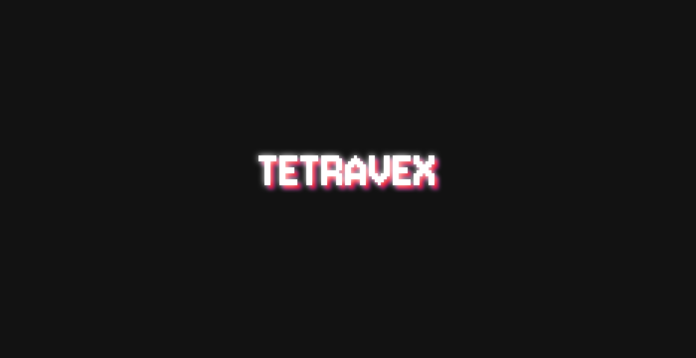
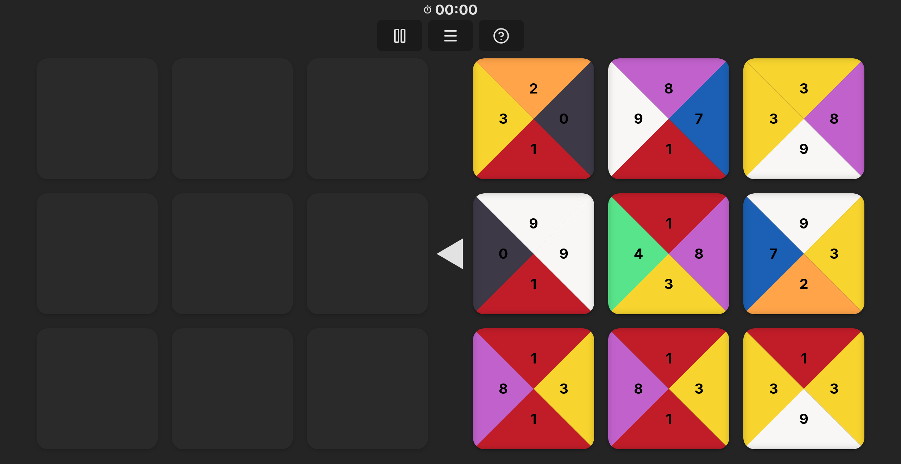
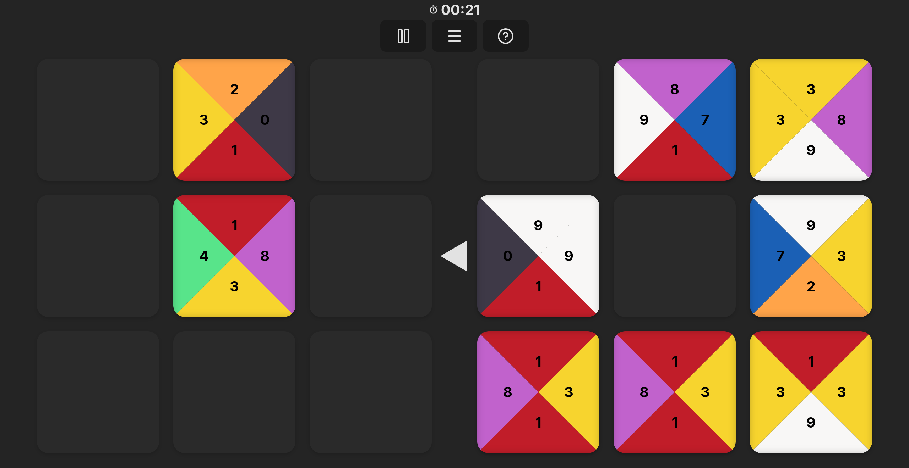

# 🧩 Tetravex Puzzle Game

A fun and challenging tile-based puzzle game built with **React** and hosted on **GitHub Pages**.  
Your goal is to arrange all the tiles on the board so that adjacent edges have matching numbers and colors.  

👉 **Play now:** [tetravex.smxlikith.xyz](https://tetravex.smxlikith.xyz/)


## 🎮 How to Play
1. Drag and drop tiles onto the grid.
2. Match all the numbers/colors on the touching edges.
3. Solve the entire board to win!


## ✨ Features
- 🔢 **Number + Color matching** puzzle mechanics  
- 🎨 Clean UI built with **React**  
- 🖱️ Drag-and-drop interactions  
- 📱 Responsive design (works on desktop and mobile)  
- 🌐 Hosted for free on GitHub Pages  


## 🚀 Tech Stack
- [React](https://reactjs.org/) – Frontend framework
- [Vite](https://vitejs.dev/) -  Vite for bundling
- [DnD Kit](https://dndkit.com/) – Drag and drop interactions
- [GitHub Pages](https://pages.github.com/) – Deployment


## 🛠️ Local Development
Clone the repository and run locally:

```bash
# Clone repo
git clone https://github.com/smxlikith/tetravex.git
cd tetravex

# Install dependencies
npm install

# Start dev server
npm run dev
```

## 📸 Screenshots

>

>


## 📄 License
This project is open source under the GPL-3.0 License

## 🙌 Acknowledgements
Inspired by the classic Tetravex puzzle game.
Built as a fun project with React + GitHub Pages.
